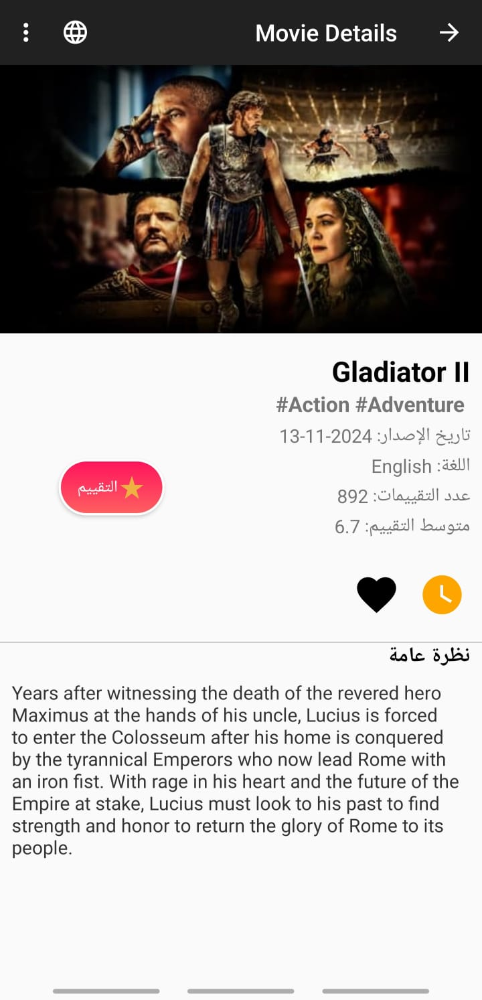

# Movie Explorer Android App

Movie Explorer is an Android application for discovering and managing movies, designed as part of the **SWE483 Mobile Development Course**. The app leverages [The Movie Database (TMDb) API](https://developer.themoviedb.org/docs/getting-started) to provide users with an engaging experience to explore, rate, and organize their favorite movies. It supports both **Arabic** and **English** languages.

---

## Key Features

### Discover Movies
- **Browse Movies:** Explore recent and top-rated movies.
- **Movie Information:** View posters, titles, overviews, release dates, and ratings.

### Movie Details
- Access detailed information about each movie:
  - Genres, language, full overview.
  - High-resolution backdrops and posters.

### Search Functionality
- Search for movies by:
  - Title, overview, genre, or actor names.
- Filter movies based on genres like Action, Animation, Drama, and Crime.

### Favorites and Watchlist
- **Favorites:** Add movies to a favorites list for quick access.
- **Watchlist:** Manage a watchlist to track movies to watch.
- **Removal Options:** Easily remove movies from favorites or watchlist.

### User Ratings
- Rate movies using a guest session with TMDb.
- View personal ratings alongside the movie's average rating.
- Store ratings locally for offline reference.

### Multi-Language Support
- Toggle between **English** and **Arabic**.
- App layout adapts dynamically for the selected language.

### Persistence and Caching
- Uses a local SQLite database to store:
  - Favorites, watchlist, and personal ratings.
- Ensures data availability offline and between sessions.

### Responsive Design
- Supports various screen sizes and orientations.
- Offers a consistent user experience across Android devices.

---

## Screenshots

<table>
  <tr>
     <td align="center">
      <p>Recent Movies - Animation Filter</p>
      
    </td>
    <td align="center">
      <p>Recent Movies - All Genres</p>
      
    </td>
  </tr>
  <tr>
      <td align="center">
      <p>Search by Actor Name</p>
      
    </td>
    <td align="center">
      <p>Movie Details</p>
      
    </td>
  </tr>
</table>


---

## Technical Highlights

### Architecture
- Follows Android best practices for activity and layout management.
- Utilizes **RecyclerView** for efficient list rendering.

### Networking
- Uses **OkHttpClient** for making network requests to TMDb API.
- Handles asynchronous data fetching with **ExecutorService** and **Handlers**.

### Image Loading
- Implements **Glide** library for efficient image loading and caching.
- Displays images with transformations like center cropping and rounded corners.

### Data Parsing
- Parses JSON responses using **JSONObject** and **JSONArray**.
- Maps API data to custom model classes like `Movie` and `Person`.

### Localization
- Stores language preferences in **SharedPreferences**.
- Updates app locale dynamically without the need for an app restart.

### Error Handling
- Provides user feedback through **Toast** messages.
- Handles network errors and API failures gracefully.

### Third-Party Libraries
- **Glide**: For image loading and caching.
- **OkHttp**: For making HTTP requests.

---

## Collaboration

This project was developed as a collaborative effort by:
- **Suliman Aljarbou**  
  Email: [isulimanm@gmail.com](mailto:isulimanm@gmail.com)  
  GitHub: [isulimanm](https://github.com/isulimanm)
- **Anas Alsubie**  
  Email: [anas-alsubaie@hotmail.com](mailto:anas-alsubaie@hotmail.com)  
  GitHub: [anas-alsubaie](http://github.com/Anas-als3)

---

## Setup and Installation

### Prerequisites
1. Install **Android Studio** on your development machine.
2. Obtain an API key from **The Movie Database (TMDb)**.

### Clone the Repository
```bash
git clone https://github.com/isulimanm/Movie_Explorer_Android_App.git
